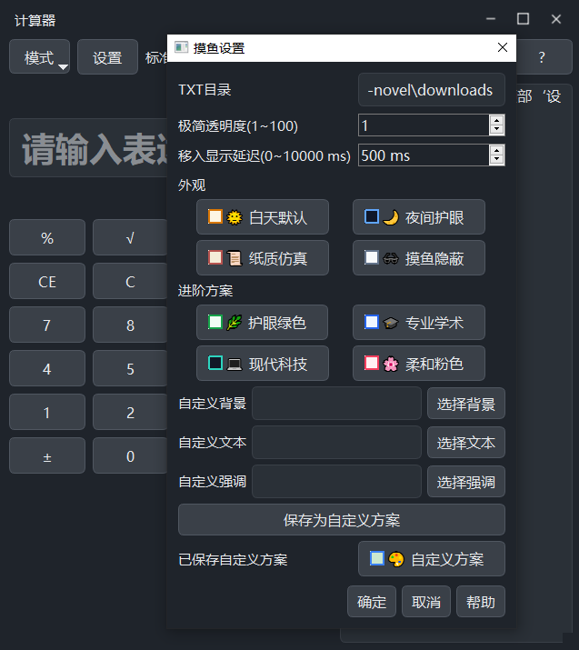
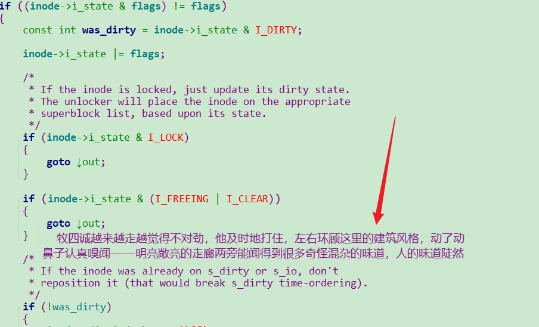
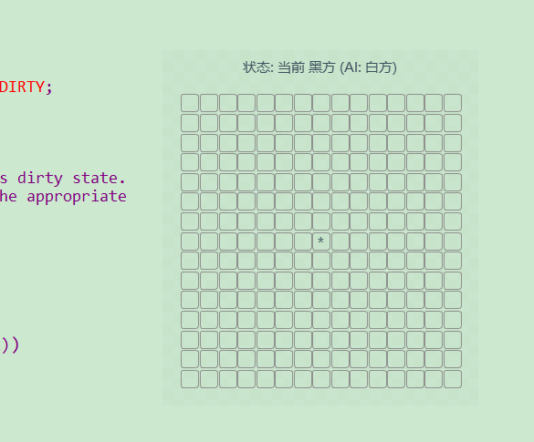
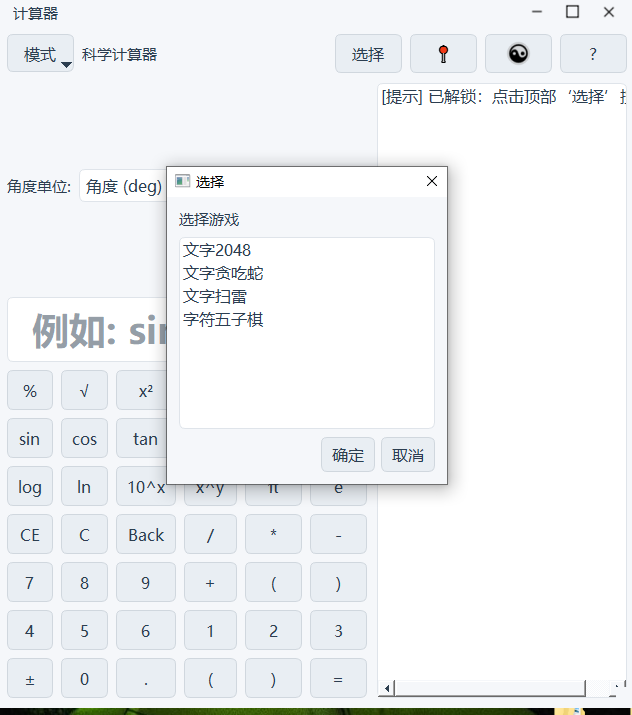
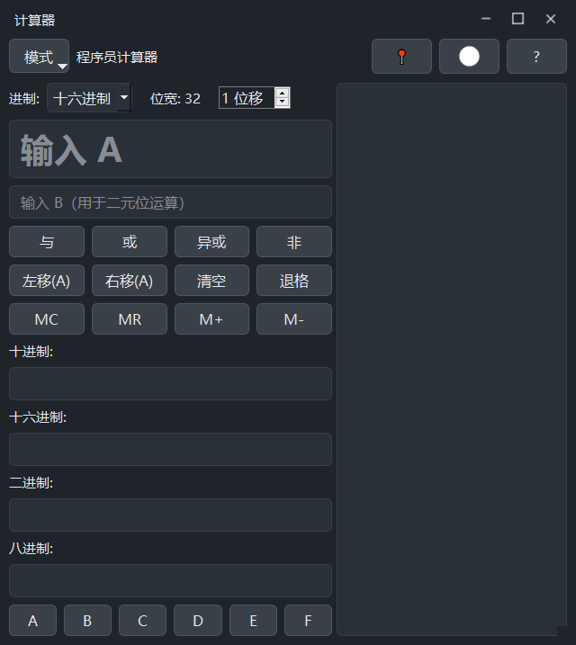
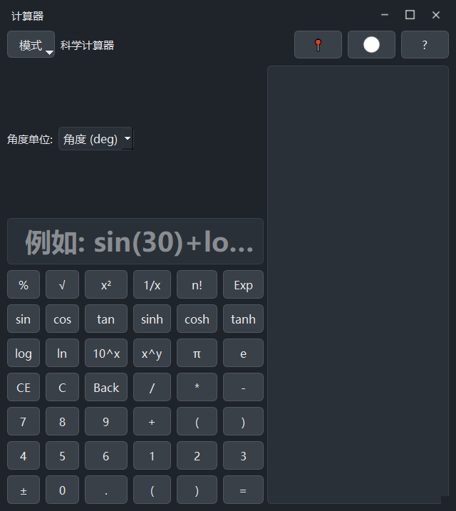
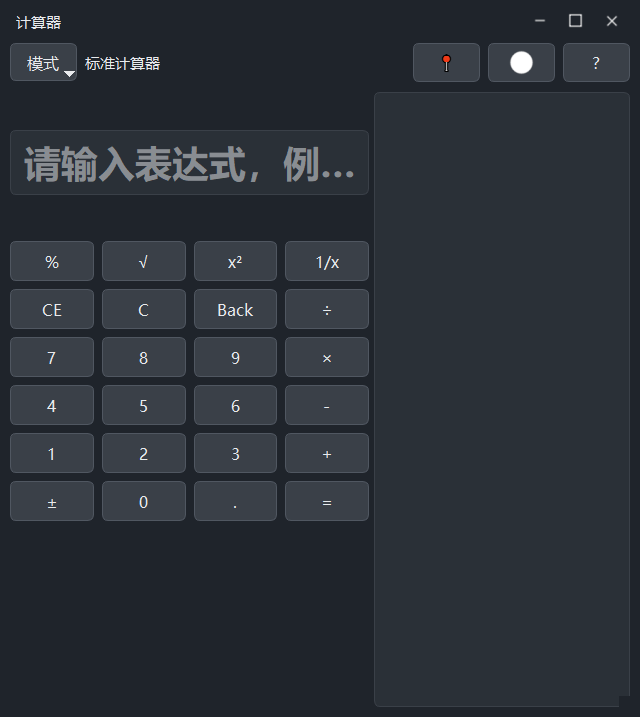

# 摸鱼计算器 (thief_counter)

这是一个基于 PySide6 开发的多功能桌面计算器应用，集成了多种计算模式与休闲小游戏。

## 功能特点

- **多模式计算**：
  - **标准模式**：满足日常四则运算需求。
  - **科学模式**：支持三角函数、对数、指数等高级运算。
  - **程序员模式**：支持 HEX/DEC/OCT/BIN 进制转换与位运算。

- **摸鱼工具**：
  - **极简阅读器**：内置 TXT 阅读功能，支持悬浮窗显示。
  - **悬隐模式**：支持鼠标移出自动隐藏，鼠标移入延迟1.5S显示 极致隐藏式摸鱼。

- **休闲娱乐**：
  - 内置多款经典小游戏：贪吃蛇、2048、扫雷、五子棋。

## 效果展示

### 摸鱼与阅读
| 摸鱼阅读设置 | 极简阅读模式 |
| :---: | :---: |
|  |  |

### 游戏功能
| 游戏模式 | 游戏选择 |
| :---: | :---: |
|  |  |

### 计算模式
| 程序员模式 | 科学模式 | 普通模式 |
| :---: | :---: | :---: |
|  |  |  |

## 环境要求

- Python 3.8+
- PySide6

## 安装说明

1. 克隆项目到本地：
   ```bash
   git clone <repository_url>
   cd thief_counter
   ```

2. 安装依赖：
   ```bash
   pip install -r requirements.txt
   ```

## 运行方式

运行以下命令启动应用：

```bash
python src/app.py
```

## 使用指南

本项目包含丰富的隐藏功能（如摸鱼阅读器、内置游戏等），建议阅读以下文档以获得最佳体验：

- 📖 [**完全使用说明书**](./USER_GUIDE.md)：详细介绍了如何开启隐藏模式、快捷键列表及游戏玩法。

## 目录结构

```
jisuanqi/
├── src/
│   ├── app.py              # 应用入口
│   ├── core/               # 核心计算逻辑
│   └── ui/                 # 界面实现与游戏逻辑
├── scripts/                # 测试脚本
├── resources/              # 资源文件 (样式表等)
└── requirements.txt        # 项目依赖
```

## 许可证

MIT License
