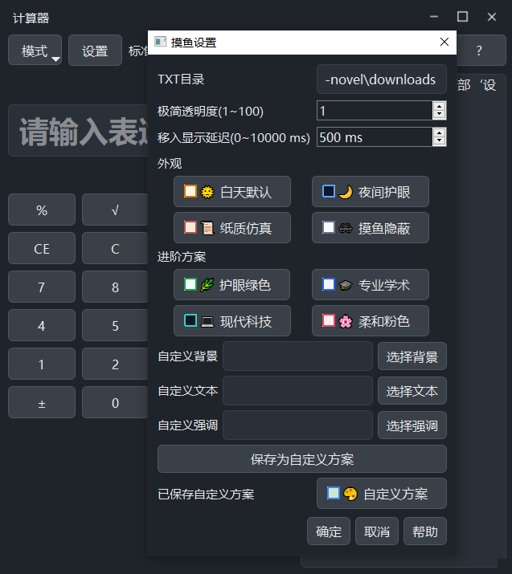
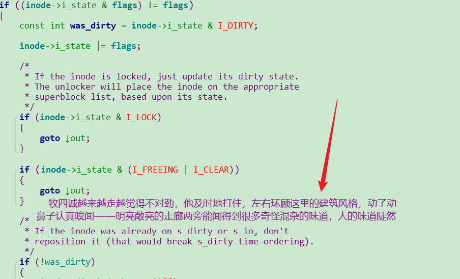
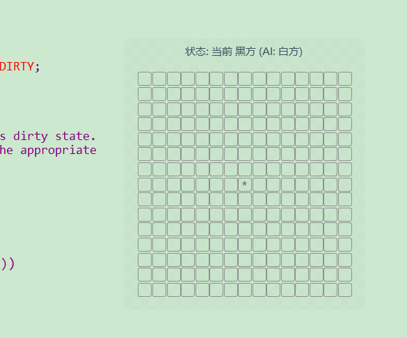
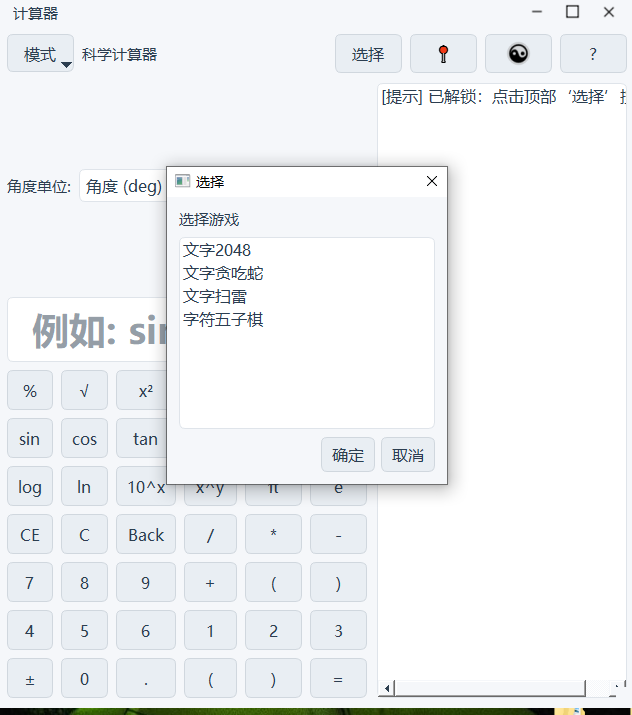
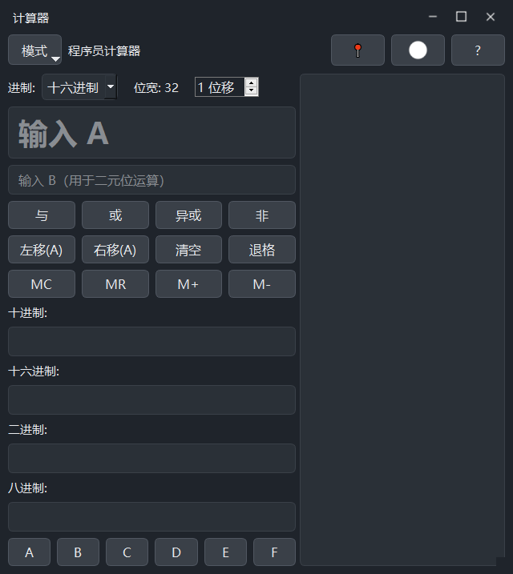
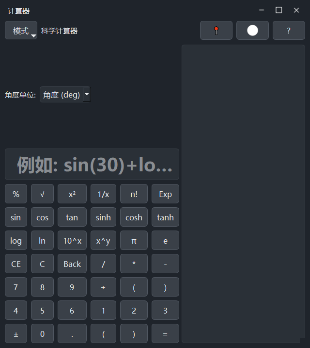
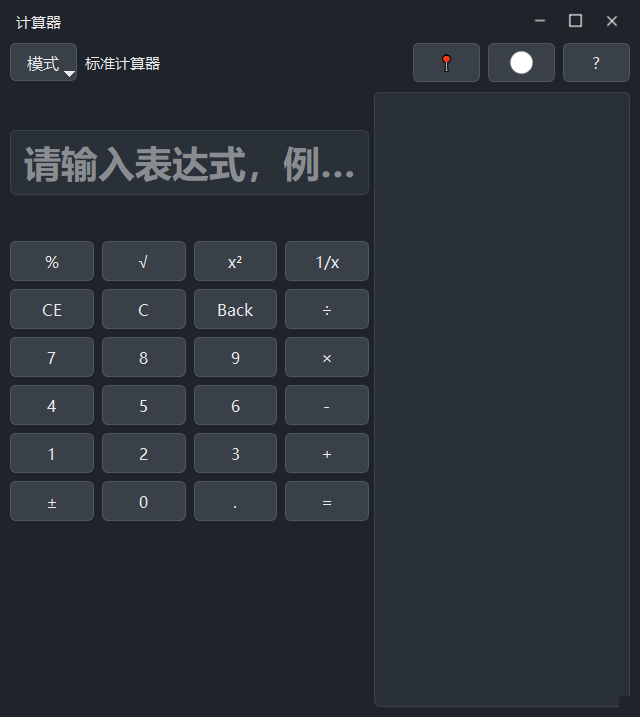

# 摸鱼计算器 (thief_counter)

一个基于 `PySide6` 的多功能桌面计算器，集成了多种计算模式、摸鱼阅读器和小游戏。它既可以当日常计算工具，也可以在工作场景里低调地看电子书、打发碎片时间。

## 功能概览

### 多模式计算

- **普通模式**：四则运算、百分比、平方、平方根、倒数、历史记录、记忆功能。
- **科学模式**：三角函数、双曲函数、对数、指数、幂运算、角度/弧度切换。
- **程序员模式**：`HEX / DEC / OCT / BIN` 进制转换、位运算、位移、32 位裁剪显示。
- **校验和模式**：面向串口报文和协议调试，支持常见字节流校验计算、验证和附加报文生成。

### 摸鱼阅读器

- 支持 **TXT** 和 **EPUB** 电子书。
- 支持目录选择、阅读进度恢复、分页浏览。
- EPUB 优先读取书内目录，章节跳转更稳定。
- 支持极简悬浮阅读窗、透明度调节、移入显示/移出隐藏。
- 支持 `Ctrl+M` 快速进入阅读模式，`Esc` 快速退出并伪装。

### 休闲娱乐

- 内置经典小游戏：
  - 贪吃蛇
  - 2048
  - 扫雷
  - 五子棋

## 效果展示

### 摸鱼与阅读

| 摸鱼阅读设置 | 极简阅读模式 |
| :---: | :---: |
|  |  |

### 游戏功能

| 游戏模式 | 游戏选择 |
| :---: | :---: |
|  |  |

### 计算模式

| 程序员模式 | 科学模式 | 普通模式 |
| :---: | :---: | :---: |
|  |  |  |

## 环境要求

- Python 3.11 推荐
- Windows
- `PySide6`

## 安装依赖

```bash
pip install -r requirements.txt
```

当前 `requirements.txt` 只包含 `PySide6`。如果你要打包 exe，还需要额外安装：

```bash
pip install pyinstaller
```

## 运行方式

直接启动应用：

```bash
python src/app.py
```

## 打包方式

项目已经提供了现成的 PyInstaller 规格文件 [thief_counter.spec](./thief_counter.spec)。

执行下面的命令即可打包最新 exe：

```bash
pyinstaller thief_counter.spec --noconfirm
```

打包完成后，产物默认位于：

```text
dist/thief_counter.exe
```

## 使用提示

### 模式切换

- 左上角“模式”按钮可切换：
  - 普通计算器
  - 程序员计算器
  - 校验和计算
  - 科学计算器

### 摸鱼阅读入口

- 在普通模式输入隐藏密钥 `666888` 并按 `=`，可解锁顶部“设置”按钮。
- 配置电子书目录后，可通过 `Ctrl+M` 快速恢复上次阅读。
- 阅读目录支持 `.txt` 和 `.epub` 文件。

### 快捷键

- `Ctrl+M`：快速进入/恢复摸鱼阅读
- `Esc`：退出摸鱼模式
- `W / S`：上一页 / 下一页
- 连续点击 4 次 `=`：唤出极简悬浮阅读窗

## 测试

核心逻辑测试可通过 `unittest` 运行：

```bash
python -m unittest tests.test_core_engines -v
```

目前测试主要覆盖：

- 表达式解析
- 科学计算函数
- 程序员模式核心逻辑
- 校验和引擎
- TXT / EPUB 电子书解析

## 项目结构

```text
jisuanqi/
├── src/
│   ├── app.py                 # 应用入口
│   ├── core/                  # 核心逻辑
│   │   ├── book_loader.py     # TXT / EPUB 电子书加载
│   │   ├── checksum_engine.py # 校验和算法
│   │   ├── expr_parser.py     # 安全表达式求值
│   │   ├── programmer_engine.py
│   │   ├── scientific_engine.py
│   │   └── settings_service.py
│   ├── resources/             # QSS 样式与资源
│   └── ui/                    # 主窗口与各模式界面
├── img/                       # README 展示图片
├── tests/                     # 核心测试
├── thief_counter.spec         # PyInstaller 打包配置
├── USER_GUIDE.md              # 详细使用说明
└── requirements.txt
```

## 文档

- [USER_GUIDE.md](./USER_GUIDE.md)：完整使用说明书，包含隐藏功能、阅读器操作和小游戏玩法。

## 许可证

MIT License
